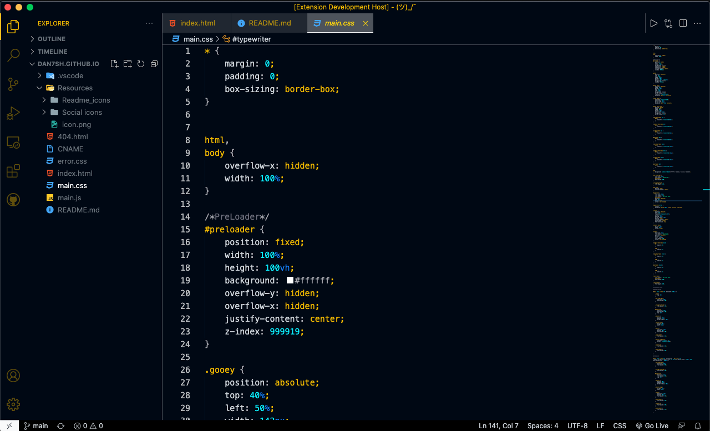
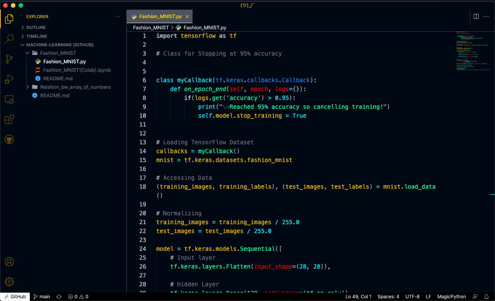

# **Mariana Theme**
 [ ***&#35;OpenSource✌️***](https://github.com/dan7sh/mariana-theme) 
 
  

One of the best **Dark Themes** in VSCode 😉 !
 

### Preview

  

 

  

 

### Support
All **major programming languages** are supported.  Support for new languages are constantly being added with **minor updates**.
 [Contributions](https://github.com/dan7sh/mariana-theme) are always **welcomed** and **appreciated**!

 

### Issues
If any **programming language** is not supported or if you find a **bug**, raise an **issue** [here](https://github.com/dan7sh/mariana-theme/issues).

 

---

 

Check out my <a href="https://danishansari.dev/">website</a>.

 

---

<b>Enjoy!</b>

---